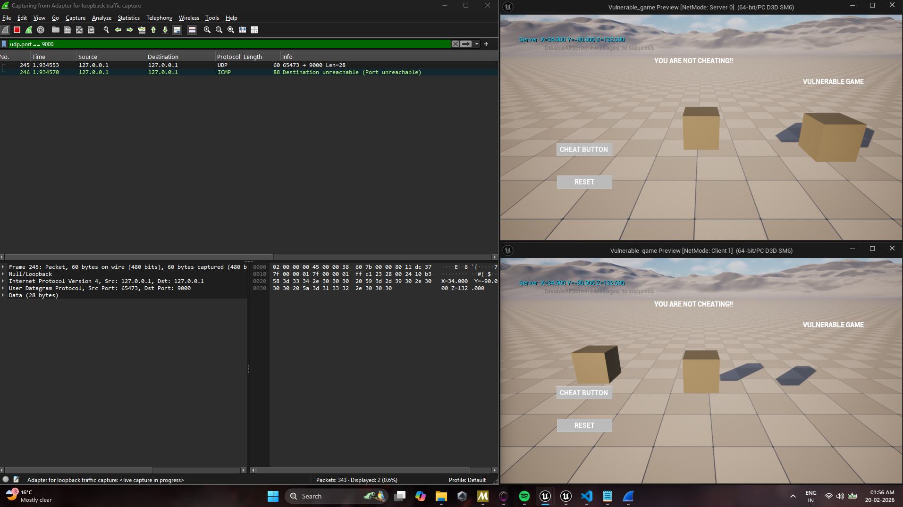
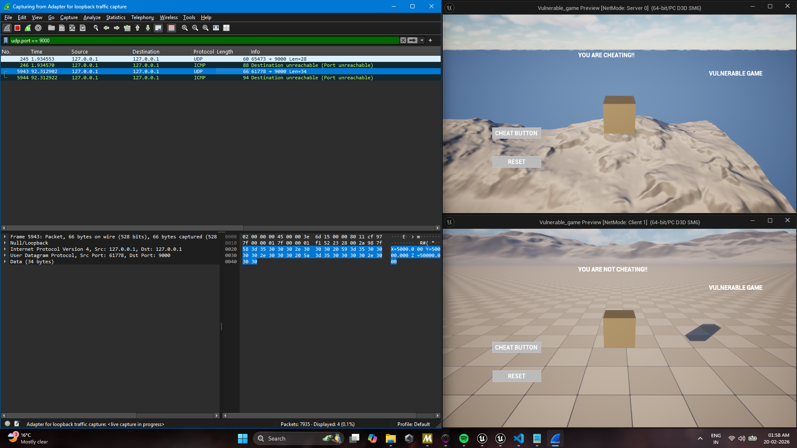

# Trust-Gap-Unreal: Vulnerable Version 

This branch demonstrates a "Trusting Server" model where game logic is entirely authoritative on the client side, making the game highly susceptible to packet manipulation and coordinate injection.

##  The Vulnerability
In this version, the server blindly accepts coordinates from the client via an unprotected RPC. There is no validation to check if the movement is physically possible.

### 1. Packet Sniffing (The Protocol)
Using Wireshark, we can see that the movement data is sent as human-readable plaintext over UDP. This allows an attacker to identify the exact structure of the movement packets.

*Evidence: Raw coordinate data (X=34,Y=-90,Z=132) visible in the UDP payload.*

### 2. Client-Side Injection
The client-side UI contains a "Cheat Button" that directly calls the `Server_Mover` RPC with arbitrary coordinates.

*Blueprint: The client dictates its own position to the server.*

## 🛠️ Reproduction Steps
1. Open the project in the `vulnerable-demo` branch.
2. Compile the project the moment you open it.
3. Launch a Listen Server with at least one Client.
4. On the Client window, click the **Cheat Button**.
5. Observe the cube instantly teleporting to X=50000 on both the Client and Server screens.

> **Conclusion:** Because the server lacks a "Strict Judge" logic, the client has total control over game state.
