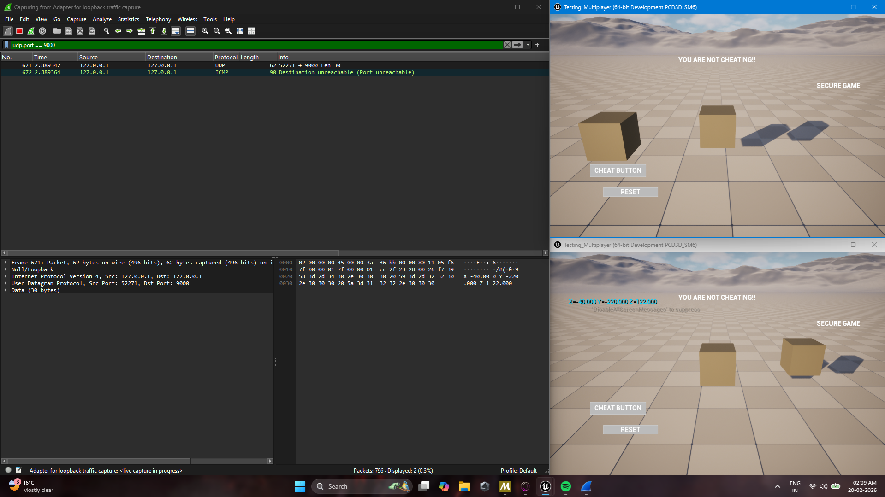
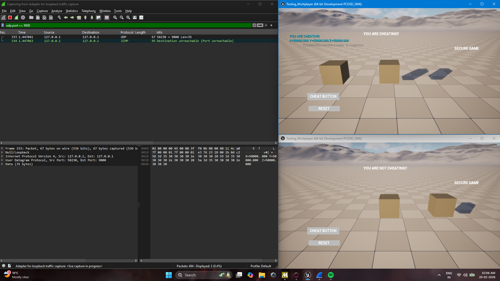

# Trust-Gap-Unreal: Secure Version 

This is the authoritative version of the project. It implements a **Server-Side Validation** layer that intercepts client requests and evaluates them against game rules before updating the world state.

## Security Implementations

### 1. The "Strict Judge" (Server Validation)
The server now calculates the distance between the player's current location and the is greater than 25 units in a single frame, the request is flagged as a cheat and ignored.
YOU CAN OBVISOULY CHANGE IT/ENCHANCE IT MORE 

![Server Validation Logic]
*Logic: A Branch node blocks the execution path to SetActorLocation if validation fails.*

*The Client sents a packet to server normally and it acceppts it as it is considered "good" as in not exploting the game rule of threshold disscused previously .*

### 2. State Synchronization (Replication)
When a cheat is detected, the server updates a **Replicated Variable** (`Cheating?`). This ensures the "truth" of the cheat status is broadcasted back to the client's UI.

*Result: The client is notified of the violation, and the movement is blocked.*

##  Key Features
* **Authoritative RPCs:** Server-side distance checking.
* **Replicated State:** UI synchronization across network nodes.
* **Ownership Security:** Only the owning client can communicate with the server regarding their specific pawn.

## 📊Comparison summary
| Feature | Vulnerable Branch | Master Branch |
| :--- | :--- | :--- |
| **Server Trust** | Full (Client-Led) | None (Authoritative) |
| **Distance Check** | None | Yes (>25 Units/Frame) |
| **Packet Visibility** | Plaintext Exploit(Forced) | Logic Intercepted |
| **Result of Cheat** | Teleport Success | Teleport Blocked |
